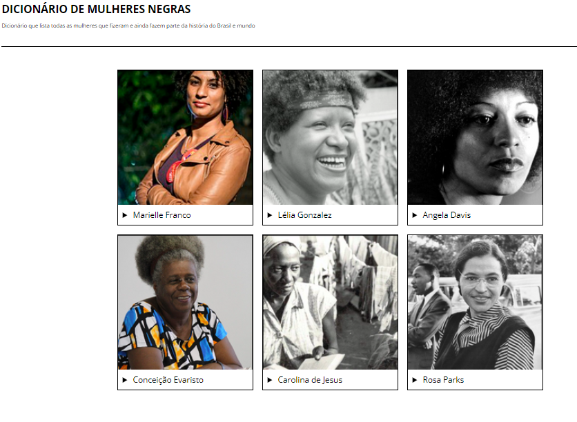

# Dicionario-Mulheres-Negras-PrograMaria
## Projeto responsivo do curso EuProgramo Front-end II da PrograMaria

Este projeto é um dicionário que lista as mulheres negras que fizeram e ainda fazem parte da história do Brasil e mundo.

##  Tecnologias

- HTML
-CSS 
-Javascript
- Git e Github